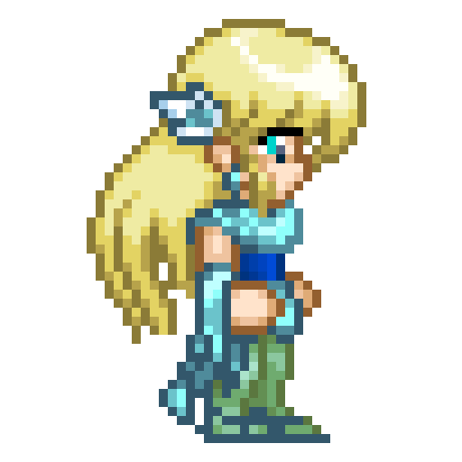
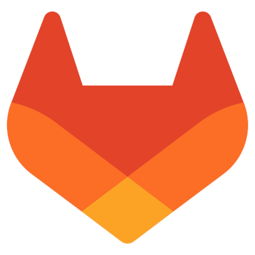
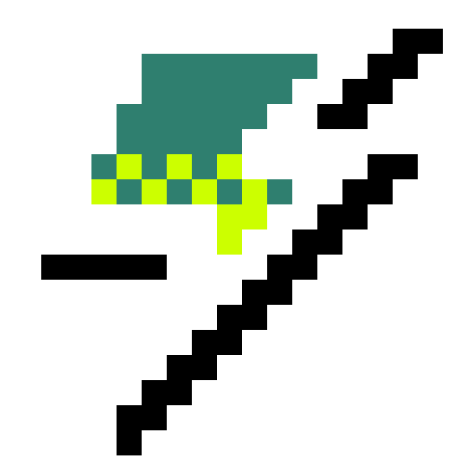

  <h2 align="center">Hey! I'm OgelGames </h2>

  <a href="https://github.com/DenverCoder1/readme-typing-svg" target="_blank">
    <picture>
      <source
        srcset="https://readme-typing-svg.demolab.com?weight=600&size=20&duration=2000&pause=2000&color=E6EDF3&center=true&vCenter=true&width=500&lines=I+make+games+with+Godot;I+make+mods+for+Minetest;I+write+code+in+Lua+and+C%2B%2B"
        media="(prefers-color-scheme: dark)"
      />
      <source
        srcset="https://readme-typing-svg.demolab.com?weight=600&size=20&duration=2000&pause=2000&color=1F2328&center=true&vCenter=true&width=500&lines=I+make+games+with+Godot;I+make+mods+for+Minetest;I+write+code+in+Lua+and+C%2B%2B"
        media="(prefers-color-scheme: light), (prefers-color-scheme: no-preference)"
      />
      
    </picture>
  </a>

  <a href="https://github.com/anuraghazra/github-readme-stats" target="_blank">
    <picture>
      <source
        srcset="https://github-readme-stats.vercel.app/api?username=OgelGames&include_all_commits=true&hide=stars&bg_color=00000000&hide_border=true&theme=github_dark_dimmed"
        media="(prefers-color-scheme: dark)"
      />
      <source
        srcset="https://github-readme-stats.vercel.app/api?username=OgelGames&include_all_commits=true&hide=stars&bg_color=00000000&hide_border=true"
        media="(prefers-color-scheme: light), (prefers-color-scheme: no-preference)"
      />
      
    </picture>
    <picture>
      <source
        srcset="https://github-readme-stats.vercel.app/api/top-langs?username=OgelGames&layout=compact&size_weight=0.5&count_weight=0.5&bg_color=00000000&hide_border=true&theme=github_dark_dimmed"
        media="(prefers-color-scheme: dark)"
      />
      <source
        srcset="https://github-readme-stats.vercel.app/api/top-langs?username=OgelGames&layout=compact&size_weight=0.5&count_weight=0.5&bg_color=00000000&hide_border=true"
        media="(prefers-color-scheme: light), (prefers-color-scheme: no-preference)"
      />
      
    </picture>
  </a>

  <h3>Find me on:</h3>
  
  &#8287;&#8287;&#8287;&#8287;&#8287;
  
  &#8287;&#8287;&#8287;&#8287;&#8287;
  
  &#8287;&#8287;&#8287;&#8287;&#8287;
  
  &#8287;&#8287;&#8287;&#8287;&#8287;
  
  &#8287;&#8287;&#8287;&#8287;&#8287;
  
  &#8287;&#8287;&#8287;&#8287;&#8287;
  

